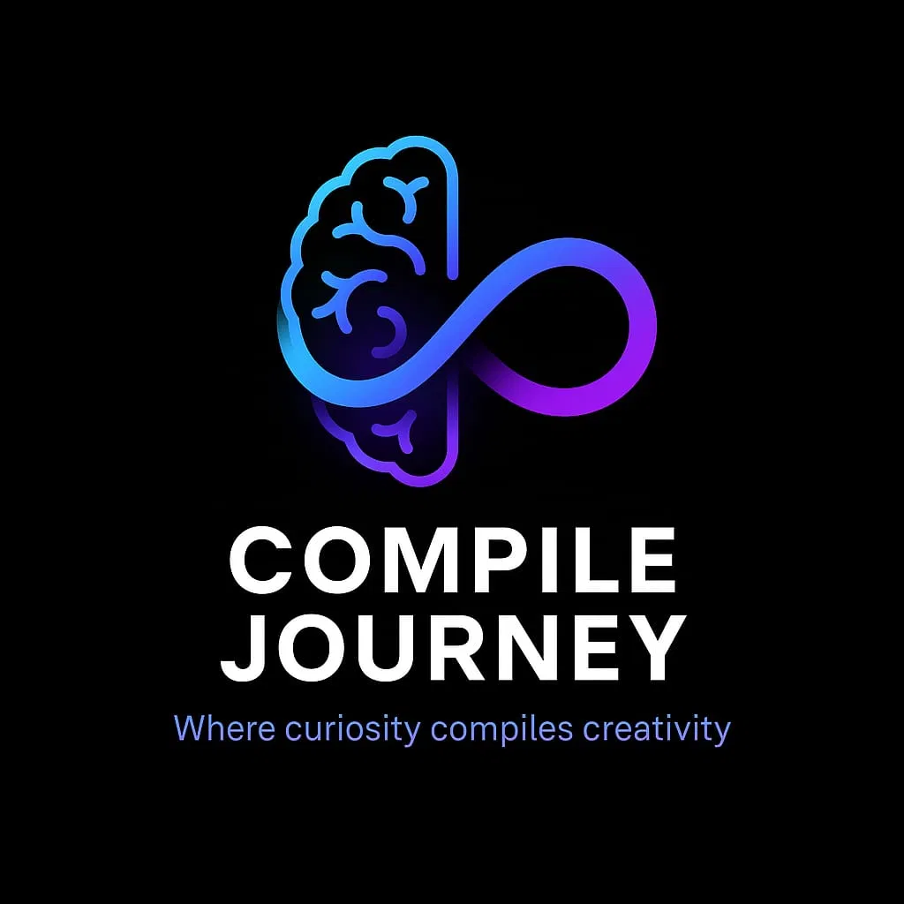

<div align="center">

<!-- Animated Header Banner -->


<br/>

<a href="https://abikrishnacj.web.app">
  
</a>

<br/>

<!-- Typing SVG Animation -->
<a href="https://github.com/Abikrishna2004">
  
</a>

<br/><br/>

<!-- Badges & Counters -->


</div>

<br/>


## 🧠 About Me

```python
class Abikrishna:
    def __init__(self):
        self.name = "Abikrishna P."
        self.role = ["Software Engineer", "AI/ML Engineer", "Data Scientist", "Full-Stack Developer"]
        self.education = "B.E. Computer Science & Engineering, Anna University"
        self.founder_of = "Compile Journey"
        self.currently_exploring = ["RAG Systems", "LLM Applications", "AI Assistants", "Production AI"]
        self.philosophy = "Learn → Experiment → Build → Break → Debug → Improve → Deploy"

    def career_goal(self):
        return "Software Engineer / AI Engineer building explainable, decision-driven intelligent systems"

me = Abikrishna()
```

- 🎓 Final-year **CSE** student at **Akshaya College of Engineering and Technology** (Anna University)
- 🤖 Building complete, end-to-end intelligent systems — not just notebooks
- 📊 Journey: `Programming → Web Dev → Data Analytics → Data Science → ML → AI → RAG → Intelligent Apps`
- 🚀 Founder of **[Compile Journey](https://abikrishnacj.web.app)** — *"Where Curiosity Compiles Creativity"*
- 💼 AI Intern @ **Infosys Springboard** · Web Dev Intern @ **ApexPlanet** · Junior Developer @ **Aroganam Technologies**
- 🏆 First Prize Winner — Autonomous Obstacle-Avoiding Vehicle | 🥉 3rd Prize — Thinklytics Contest
- 🌱 Currently sharpening: Advanced ML, RAG pipelines, System Design & DSA

<br/>


## 📊 Developer Dashboard & Focus

<div align="center">

<table>
<tr>
<td align="center" width="25%">

### 🧠 Focus
**AI & ML**
Building intelligent systems

</td>
<td align="center" width="25%">

### 📊 Data
**Data Science**
Turning data into insights

</td>
<td align="center" width="25%">

### 💻 Code
**Software Engineering**
Building scalable applications

</td>
<td align="center" width="25%">

### 🚀 Mission
**Continuous Growth**
Learn • Build • Improve

</td>
</tr>
</table>

</div>

<br/>


## 🧩 Tech Ecosystem & Skill Matrix

<div align="center">

```
                                ABIKRISHNA
                                     │
              ┌──────────────────────┼──────────────────────┐
              │                      │                       │
          SOFTWARE                 DATA                     AI
              │                      │                       │
        ┌─────┴─────┐        ┌───────┴───────┐        ┌──────┴──────┐
        │           │        │               │        │             │
    Frontend     Backend   Analytics       Science     ML           RAG
        │           │        │               │        │             │
   HTML/CSS       Flask    Excel          Python    CatBoost    ChromaDB
   JavaScript     Node.js  Power BI       Pandas    XGBoost     Embeddings
                            SQL           NumPy     Scikit-learn  LLM
```

</div>

<br/>

### 💻 Languages & Visual Tools Icon Set
<div align="center">
  
</div>

<br/>

### 🤖 AI / Machine Learning / Data Science
<p align="left">


</p>

### 🧠 RAG / LLM / Vector Search
<p align="left">


</p>

### 🌐 Web & Databases & Analytics
<p align="left">


</p>

<br/>


## 🚀 Featured Projects

<div align="center">

<table>
<tr>
<td width="50%" valign="top">

### 🛡️ ProjectRisk AI
**AI Project Risk Forecasting & Decision Intelligence**

Predicts project risk and surfaces early warning signals before failure becomes critical, using project features across team, budget, scope, and delivery dimensions.

`CatBoost` `XGBoost` `Scikit-learn` `Streamlit` `SQLite`

<br/>
<a href="https://github.com/Abikrishna2004">
  
</a>

</td>
<td width="50%" valign="top">

### 🔬 AI Early Warning System
**Hidden Project Failure Signal Detection**

Research-oriented system that explains *why* a project is at risk — not just that it is — using AI, ML, Data Mining, and RAG for decision intelligence.

`AI` `ML` `Predictive Analytics` `RAG` `AI Assistant`

<br/>
<a href="https://github.com/Abikrishna2004">
  
</a>

</td>
</tr>
<tr>
<td width="50%" valign="top">

### 🚗 Autonomous Obstacle-Avoiding Vehicle 🏆
**First Prize Winner**

Embedded autonomous vehicle capable of real-time obstacle detection and navigation decisions.

`Embedded Systems` `Sensors` `Automation` `Python`

</td>
<td width="50%" valign="top">

### 🩺 AI Disease Prediction System
**ML-based Disease Risk Classifier**

Predicts disease risk from user-provided health information using classical ML pipelines.

`Python` `Pandas` `NumPy` `Scikit-learn`

</td>
</tr>
<tr>
<td width="50%" valign="top">

### 🛒 E-Commerce Platform
**Full-Stack Shopping Application**

Product listing, cart, and order workflow built end-to-end across frontend and backend.

`HTML` `CSS` `JavaScript` `Node.js`

</td>
<td width="50%" valign="top">

### 📚 Compile Journey Platform
**Technology Learning Ecosystem**

Structured learning platform spanning Python, Data Analytics, Data Science, ML, AI, and DSA.

<br/>
<a href="https://abikrishnacj.web.app">
  
</a>

</td>
</tr>
</table>

</div>

<br/>


## 🏆 GitHub Achievements & Profile Trophies

<div align="center">
  
</div>

<br/>


## 📈 GitHub Analytics & Real-Time Stats

<div align="center">


<br/><br/>


<br/><br/>


<br/><br/>

<!-- Snake Contribution Animation -->
### 🧬 Contribution Snake


<br/><br/>

<!-- Extended Metrics Dashboard -->
### 📈 Profile Metrics Dashboard


</div>

<br/>


## 🧭 Developer Growth Timeline

```text
2024
│
├── 🐍 Started building with Python
├── 📊 Explored Data Analytics
└── 🌐 Developed Web Projects

2025
│
├── 🤖 Started Machine Learning
├── 📈 Worked on Data Science Projects
└── 🚀 Built Compile Journey

2026
│
├── 🧠 Building AI-powered applications & RAG Systems
├── 🛡️ Developing ProjectRisk AI Platform
├── 🔬 Exploring RAG & AI Assistants
└── 💻 Strengthening DSA & System Development

2027
│
└── 🎯 Goal → Software Engineer / AI Engineer
```

<br/>


## 🎯 Current Mission Control

<div align="center">

| Objective | Status |
| :--- | :---: |
| 🤖 Build Intelligent AI Systems | 🟢 Active |
| 📊 Master Data Science & Analytics | 🟢 Active |
| 💻 Improve DSA & System Design | 🟡 In Progress |
| 🌐 Build Production Applications | 🟢 Active |
| 🔬 Research & RAG Innovation | 🟢 Active |
| 🚀 Open Source Contributions | 🟡 Growing |

</div>

<br/>


## 📚 Compile Journey Initiative

<div align="center">
<table>
<tr><td>

<div align="center">

</div>

**Compile Journey** is my personal technology education initiative — helping learners move through tech topics with structured, practical, project-driven paths:

```
Foundation → Practice → Projects → Advanced Concepts → Career Preparation
```

- 🐍 **Python Mastery Guide** — a large-scale, structured guide spanning fundamentals through advanced DSA & placement prep
- 📊 **Data Analyst Roadmap** — a 505-topic structured booklet covering Excel, SQL, Python, Statistics, EDA, Power BI & interview prep

<br/>

<div align="center">
<a href="https://instagram.com/compile.journey">
  
</a>
<a href="https://abikrishnacj.web.app">
  
</a>
</div>

</td></tr>
</table>
</div>

<br/>


## 🏆 Achievements & Certifications

| 🏅 Achievements | 📜 Certifications |
|---|---|
| 🥇 **First Prize** — Autonomous Vehicle Project | Guru99 Software Testing (Beginner) |
| 🥉 **3rd Prize** — Thinklytics Contest | Python Data Analysis — LinkedIn Learning |
| 📈 **~10K LinkedIn Followers** | Excel Dashboard Creation |
| 🤖 **Infosys Springboard AI Internship** | HackerRank Python |

<br/>


## 🔗 Connect With Me

<div align="center">

<a href="https://www.linkedin.com/in/abikrishna"></a>
<a href="https://instagram.com/compile.journey"></a>
<a href="https://abikrishnacj.web.app"></a>
<a href="https://github.com/Abikrishna2004"></a>

<br/><br/>

### 💡 *"Build. Learn. Improve. Repeat."*

<br/>


<sub>⭐ Abikrishna P. &nbsp;•&nbsp; AI • Machine Learning • Data Science • Software Engineering &nbsp;•&nbsp; Founder of <a href="https://abikrishnacj.web.app">Compile Journey</a></sub>

</div>
